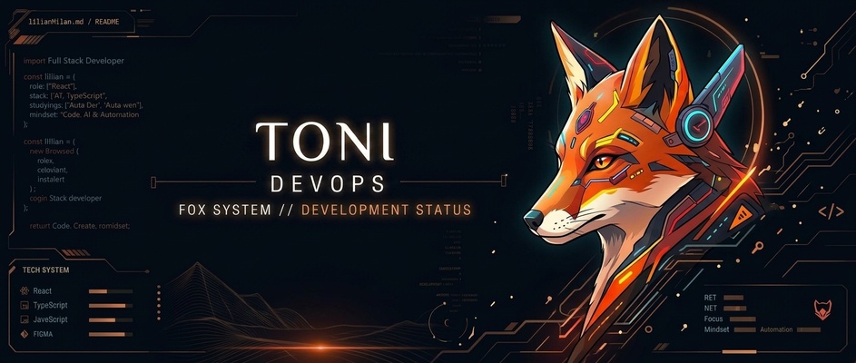

<div align="center">
  
</div>

<br>

### 01 // FOX_IDENTITY

@toniinformatica_

02 // FOX_STACK


03 // FOX_TERMINAL

```json
const developer = {
  name: "Toni",
  role: "DevOps Engineer & Full Stack",
  stack: ["React", "TypeScript", "Node", "Docker", "AWS"],
  buildings: "Rota Dev",
  mindset: "Code. Deploy. Automate. Evolve."
};
> booting fox system...
> [OK] Developer profile loaded
> [OK] Infrastructure modules loaded
> [OK] CI/CD pipelines online

ROLE: DevOps Engineer
STACK: Node | Docker | AWS | CI/CD
BUILDING: Rota Dev
STATUS: Focused

> awaiting next challenge..._

